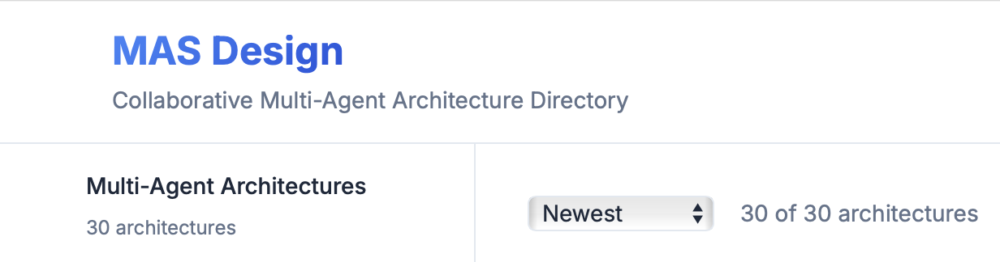
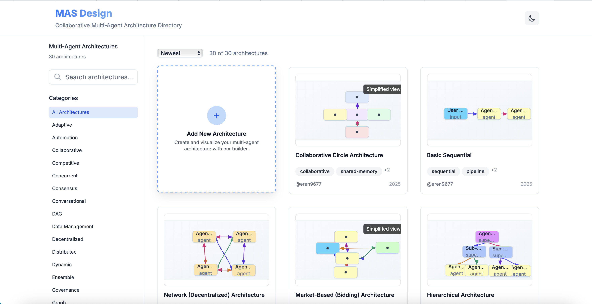

<div align="center">
  
</div>

# Multi-Agent Architectures - Open Source Collaboration Platform

Welcome to the "MAS-multi-agent-architectures" repository! This collection was created to showcase and share innovative multi agent AI architectures, but these patterns work great with various AI frameworks and development approaches.

Multi-agent architectures represent a sophisticated approach to AI system design, where multiple specialized AI agents collaborate to solve complex problems. These systems can range from simple sequential workflows to complex distributed networks, each with unique strengths and applications.

In this repository, you will find a variety of multi-agent architecture patterns that can be used with different AI frameworks and development approaches. We encourage you to add your own architectures to the list, and to use AI to help generate new patterns as well.

To get started, visit site or simply clone this repository and explore the architectures. You can also use these patterns as inspiration for creating your own multi-agent systems.

We hope you find these architectures useful and have fun exploring the  world of multi-agent AI systems!

<div align="center">
  
</div>

## 🚀 Features

- **Grid-based Architecture Display**: Responsive grid layout showcasing different multi-agent architectures
- **Smooth Modal System**: Detailed architecture views with smooth fade-in/fade-out animations
- **Advanced Search & Filtering**: Search by title, description, tags, or author with category and sort filtering
- **Performance Metrics**: Visual performance indicators for scalability, complexity, and reliability
- **Responsive Design**: Mobile-first design that works across all devices
- **Modern UI**: Clean, modern interface with indigo blue color scheme and smooth animations

## 📦 Installation

1. Clone the repository:
```bash
git clone https://github.com/eren9677/MAS-multi-agent-architectures.git
cd MAS-multi-agent-architectures
```

2. Install dependencies:
```bash
npm install
```

3. Run the development server:
```bash
npm run dev
```

4. Open [http://localhost:3000](http://localhost:3000) in your browser.

The application includes 30 sample multi-agent architectures:

## 🤝 Contributing

1. Fork the repository
2. Create a feature branch (`git checkout -b feature/amazing-feature`)
3. Commit your changes (`git commit -m 'Add amazing feature'`)
4. Push to the branch (`git push origin feature/amazing-feature`)
5. Open a Pull Request

## 📄 License

This project is licensed under the CC0-1.0 License - see the [LICENSE](LICENSE) file for details.

## 🙏 Acknowledgments

- Inspired by the design aesthetics of prompts.chat
